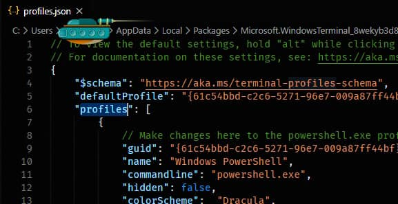
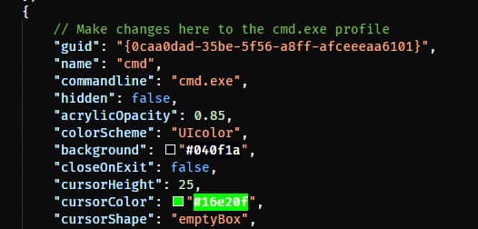
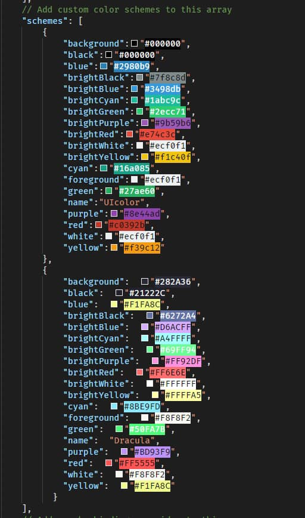

Rock your CMD 🎊🎊

Developer တိုင်း နဲ့ မလွတ်ကင်းနိုင် တဲ့ အရာတခုကတော့ Command Line Interface(CLI) ပါ. Code ရေး တဲ့ သူ အတော်များများကတော့ Windows ရဲ့ CMD ကို Linux/Unix တို့ရဲ့ Terminal နဲ့ နှိုင်းပြီးလှောင် တတ်ကြပါတယ်..

အခုရော ?
Windows ရဲ ့ next big step ပေါ့ configure လုပ်ပြီး သုံးချင်သူတွေ အတွက် ကိုယ်တိုင် tweak လုပ်နိုင်မယ့် Window Terminal ကို microsoft က ထုတ်ပြလိုက်ပါပြီး.
Linux ထက်တောင် ပိုပြီး customize လုပ်လို့ ရနိုင်တဲ့ options တွေပေးထားတာမို့ Windows နဲ့ develop လုပ်နေတဲ့ Bro တွေအတွက် သတင်းကောင်းပေါ့
နောက် တခု က Linux /Unix Environment မှာ လူကြိုက်များနေတဲ့ Z-Shell နဲ့ Z-Shell ရဲ့ နာမည် ကြီး plugins တွေနဲ့ ဆင်တူတဲ့ Wndows Terminal(preview) တွေလည်း ရှိတာ် အဲ့ဒါ အပြင် Ubuntu Terminal ပုံစံ မျိုးလည်း integration လုပ်သုံးခွင့် ပေးထားသေးတော့ အရမ်းမိုက်သွားပြီးပေါ့ 😁

⚠️ warning ! ဒါပေမယ့် အဲ့ လို plugins / integration တွေက ထည့်ပြီးရင် လေးသွားလို့ အားမပေးပါဘူး

How to configure ? then...

မိတ်စက်ပြီးပြီး ဆိုတော့.. ဘယ်လို configure လုပ်ရမလဲ ဆိုတာ ပြောပြပေးသွားပါမယ်..

1. ပထမဆုံးကတော့ Microsoft Store ထဲ သွားပြီး Windows Terminal(Preview) ကို install လုပ်ပါ

2. install လုပ်ပြီးရင် ပေါ်လာမယ့် terminal က ပုံ တုံးနေဦးမယ် အဲ့အတွက် ကိုယ်ကြိုက်တဲ့ theme တွေနဲ့ configure လုပ်လို့ ရပါတယ်
Theme ဆိုတာနဲ့ Linux/Unix terminal လိုမျိုး official theme file တွေ ကို သွားပြီး install လုပ်လို့ မရသေးပါဘူး ဘာလို့လဲ ဆိုတော့ Windows Terminal က preview edition ထဲ မှာပဲ ရှိသေးလို့ပါ
အဲ့အတွက်ကြောင့် ကိုယ်ပိုင် custom theme/ fonts တွေ သတ်မှတ်ပေး ရမယ်ပေါ့

အောက်က ပုံအတိုင်း Settings ကို နှိပ်လိုက်ရင် ကိုယ့်ရဲ့ default editor ပွင့်လာလိမ့်မယ်

3. Editor ထဲ မှာ တော့ cmd / Window Power shell အတွက် Color Scheme (သို့မဟုတ်) theme အတွက် properties တွေ ရေးပေးရပါမယ်
4. Color Scheme/theme အတွက် properies ရေးတာက CSS ရေးဖူးသူတိုင်း ရေးရလွယ်မှာပါ. အောက်မှာ sample လေး ပေးထားတယ်
5. ပုံက profiles ထဲ မှာ "name":"cmd" ဆိုတာက cmd ရဲ့ profile ပါ.. cmd အတွက် theme ပေး ချင်ရင် အဲ့ profile ထဲက colorSchme နေရာမှာ ကိုယ့်ရဲ့ theme name လေး ရေးပေးလိုက်ရုံပဲ
6. ဒါဖြင့် colorSchme/theme က ဘယ်မှာရေးရမှာလဲ ? အဲ့ profiles.json file အောက်ဆုံး schemes ဆိုတဲ့ array ထဲမှာ object တခုအနေ နဲ့ ရေးပေးရပါမယ် ပြီးရင် အဲ့object ထဲ မှာ theme name လေး သတ်မှတ်လိုက်ရင် ရပါပြီး
example က ပုံထဲကအတိုင်း..

အားလုံး ခြုံပြောရရင်
profile ထဲက CMD ဖြစ် ဖြစ် Power Shell ဖြစ်ဖြစ် custom theme လေး ထည့်ချင်ရင် အောက် က schemes array မှာ theme object လေးတခု ဆောက်ပြီး နာမယ်ပေး ရမယ် အဲ့နာမယ် ကိုပဲ အပေါ်က profile ထဲ ကိုယ် customize လုပ်ချင်တဲ့ cmd/powershell/azure shell တွေမှာ scheme နာမည်ကို "colorScheme":"themename" လေး တူအောင်ရေးလိုက်ရုံပါပဲ

မရှင်းတာလေးများ ရှိရင် Cb မှာ message ပို့ထားပေးပါ ✌️
အားလုံး အဆင်ပြေပါစေ 🙏

